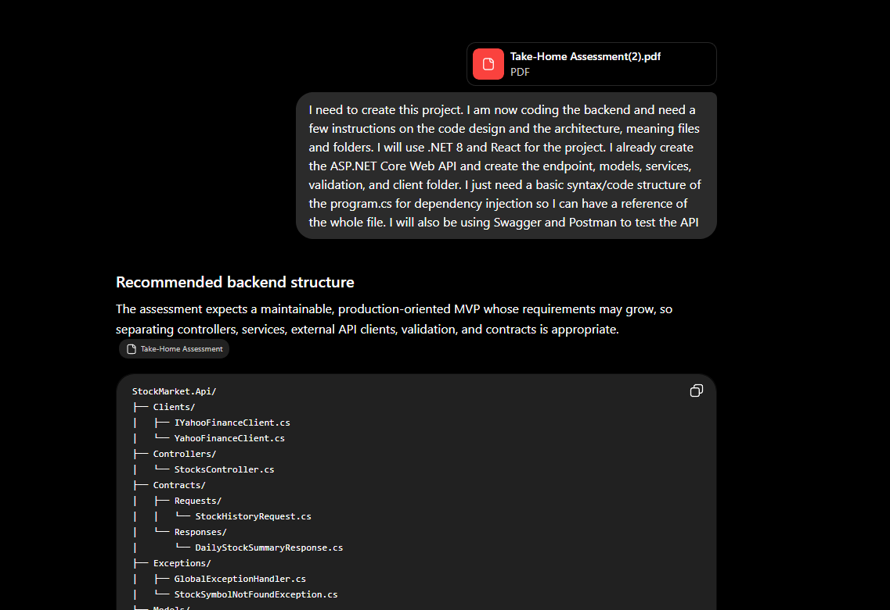
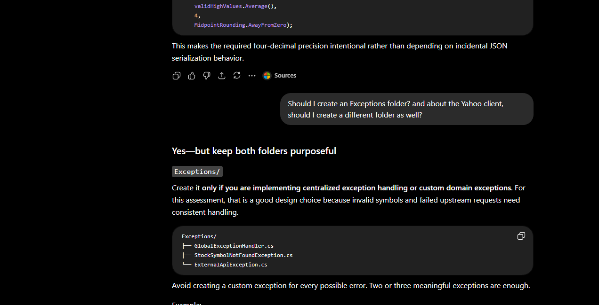
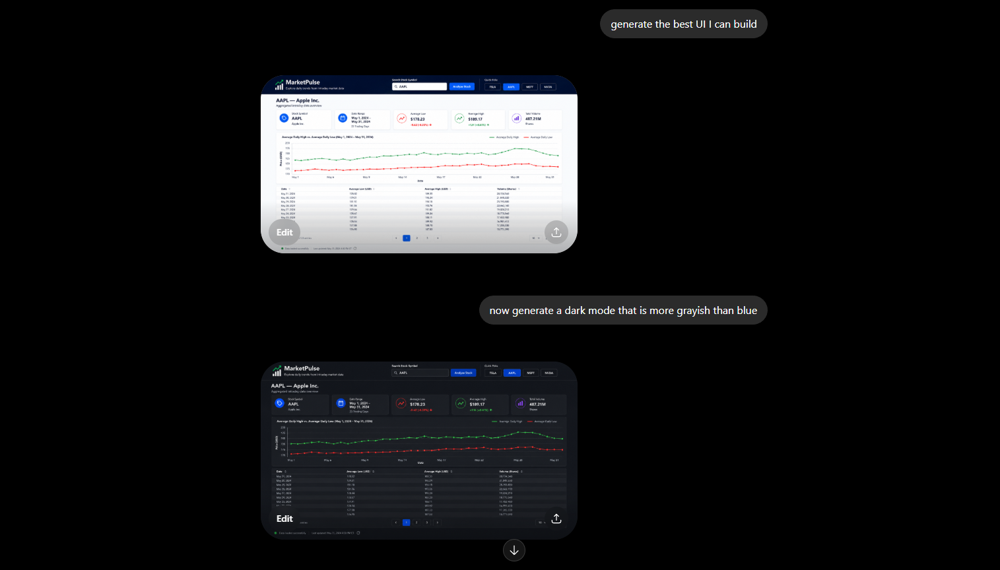
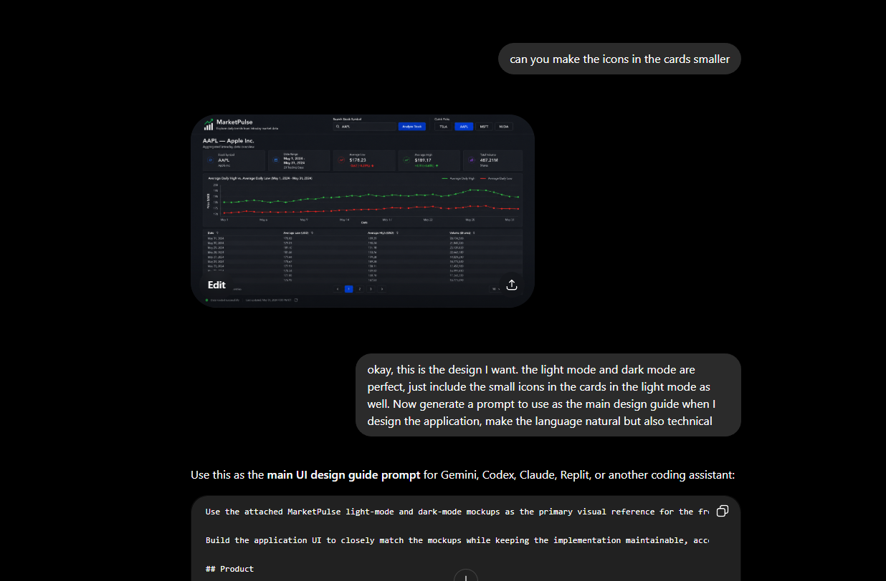

# AI Collaboration Log

I used AI tools as development collaborators for analysis, testing, frontend
implementation, refinement, and documentation. I designed and wrote the core
backend manually. I treated AI output as a proposal, reviewed it, changed or
rejected it where necessary, and verified accepted work.

## Backend authorship

> I designed and implemented the backend manually. ChatGPT was used
> as a structural review tool, mainly to discuss organization, some edge cases, and
> testing considerations. I reviewed every suggestion and made the final
> implementation decisions myself with just some syntax help from ChatGPT.

Commit `9a268df` contains my original Yahoo Finance backend. Commit `fd3c165`
adds tests and focused cleanup around that design. The backend was not
AI-generated or heavily AI-assisted.

### Developer's note

I chose to build most of the backend manually because I prefer testing API
behavior throughout development, and it gave me stronger ownership of the
implementation. I mainly used Codex for frontend implementation and refinement,
especially when locating and adjusting CSS rules across components. I also used
ChatGPT to help structure some of my Codex prompts. The technical goals and
requirements were mine, while ChatGPT helped organize them more clearly.

## Reading note

The exact prompt wording and punctuation below are preserved. I compacted only
line wrapping and blank spacing inside prompt blocks. Tool or model details that
were not recorded remain labeled `Not recorded`; no model names were inferred.
Screenshot transcriptions are labeled, and no prompt text was reconstructed.

## Summary

| Entry | Area | AI tool | Purpose | Outcome |
| --- | --- | --- | --- | --- |
| 1 | Repository analysis | Codex; model not recorded | Compare the backend with the assessment | Scope and remaining work identified without edits |
| 2 | Manual backend design | ChatGPT chatbot; model not recorded | Review structure and edge cases | My architecture remained authoritative |
| 3 | Backend verification | Codex; model not recorded | Add tests and narrow resilience fixes | Unit/integration coverage and error handling added |
| 4 | Frontend implementation | Codex; model not recorded | Build search, API flow, summaries, chart, and table | React dashboard implemented with mocked tests |
| 5 | Frontend refinement | ChatGPT chatbot and Codex; models not recorded | Refine visuals, themes, responsiveness, and accessibility | Reviewed design direction and focused fixes retained |
| 6 | Documentation | Codex; model not recorded | Produce an accurate README and collaboration record | Documentation and repository images added |

## Entry 1 — Initial repository and requirements analysis

### Tool and model

Codex; model not recorded.

### Exact prompt

```text
Inspect the existing repository and read all relevant files before making any changes.
Do not generate code, edit files, install packages, or run formatting tools in this step.
The repository is part of a full-stack application called MarketPulse.
The overall application goal is to build a production-minded MVP that:
- uses a self-hosted ASP.NET Core .NET 8+ backend - uses a React frontend - consumes a public stock-market API - allows a user to
enter a stock ticker symbol - retrieves intraday market data covering the previous month - groups the intraday records by trading
day - calculates the average low price for each day - calculates the average high price for each day - returns the daily volume -
displays the results meaningfully in the frontend using a table, chart, or both - handles invalid stock symbols and failed
requests - includes setup and run documentation - includes a prompt log describing how AI was used, what was kept, changed, or
rejected, and why
The required backend response shape is:
[ { "day": "2009-01-30", "lowAverage": 40.2958, "highAverage": 49.7534, "volume": 49073348 } ]
The average values must use four decimal places.
At the moment, this repository contains only the backend implementation. The React frontend, frontend tests, README, prompt log,
and final repository polish may not exist yet.
The backend is expected to generally follow this flow:
HTTP request → Minimal API endpoint → stock-market application service → Yahoo Finance HTTP client → Yahoo Finance API →
transformation and aggregation → JSON response
The backend should remain small and maintainable. The current MVP does not require:
- a database - EF Core - authentication - user accounts - CQRS - microservices - cloud-specific infrastructure
Your task in this step is only to understand the current repository and compare it against the full project requirements.
Please provide:
1. A concise summary of the current repository structure 2. The responsibility of each existing folder, class, interface, and
major configuration file 3. The complete backend request flow from the HTTP endpoint to Yahoo Finance and back 4. The current
dependency-injection relationships 5. The current backend API contract 6. The current status-code and error-handling behavior 7.
How stock-symbol validation and normalization work 8. How Yahoo timestamps, low values, high values, and volume values are mapped
9. How the data is grouped by trading day 10. How average prices and volume are calculated 11. How timezone handling currently
works 12. How null, incomplete, or mismatched market-data values are handled 13. How upstream failures and timeouts are handled
14. Which backend requirements are already complete 15. Which backend requirements are missing or need verification 16. Which
full-stack project requirements remain unimplemented 17. Any concrete correctness, maintainability, security, or resilience
concerns 18. A recommended next-step sequence for completing the entire project
Clearly separate:
- facts directly observed in the repository - assumptions - recommendations
Do not claim that anything builds, runs, or passes tests unless you actually verify it.
For this step, do not modify the repository.
```

### Why this prompt was used

I first needed to compare the existing backend with the assessment without
changing it.

### What was kept

- Minimal API, service, and Yahoo client separation.
- `IStockMarketService` and `IStockMarketClient` dependency boundaries.
- No database, EF Core, authentication, CQRS, or microservices.

### What was changed

Nothing; this was a read-only inspection.

### What was rejected

- Premature backend rewrites or out-of-scope infrastructure.
- Unverified build or test claims.

### Manual changes and reasoning

I used the findings to sequence later work and kept final authority over scope.

### Verification evidence

The evidence was the repository state before later test and frontend commits.

## Entry 2 — Developer-authored backend and Yahoo Finance integration

### Tool and model

ChatGPT chatbot; model not recorded.

### Exact prompt

Initial prompt shown in the first supporting screenshot:

```text
I need to create this project. I am now coding the backend and need a few instructions on the code design and the architecture,
meaning files and folders I will use, .NET 8 and React for the project. I already create the ASP.NET Core Web API and create the
endpoint, models, services, validation, and client folder. I just need a basic syntax/code structure of the program.cs for
dependency injection so I can have a reference of the whole file. I will also be using Swagger and Postman to test the API
```

Follow-up prompt shown in the second supporting screenshot:

```text
Should I create an Exceptions folder? and about the Yahoo client, should I create a different folder as well?
```

### Why this prompt was used

I wanted a structural reference for `Program.cs`, exceptions, and the Yahoo
client while implementing the backend myself.

### Supporting screenshots





### What was kept

- My Minimal API, aggregation service, typed Yahoo client, nullable data model,
  exchange-timezone metadata, and database-free architecture.

### What was changed

I wrote the backend manually; later AI-assisted work was limited to tests and
focused resilience fixes.

### What was rejected

- Describing the backend as AI-generated.
- Controllers, CQRS, persistence, microservices, or an invented prompt.

### Manual changes and reasoning

I chose the endpoint, dependencies, provider mapping, aggregation, and error
model. ChatGPT was limited to structural review.

### Verification evidence

Commit `9a268df` (`Create Backend for Yahoo API`) contains my backend.

## Entry 3 — Backend tests and resilience fixes

### Tool and model

Codex; model not recorded.

### Exact prompts

#### Prompt A — Unit tests

```text
Inspect the current MarketPulse.Api repository and follow the existing architecture.
Create a new xUnit test project named MarketPulse.Api.Tests and add it to the solution.
Do not modifi production code unless a test exposes a real correctness issue.
Add focused tests for:
1. StockSymbolValidator - accepts AAPL - accepts BRK.B - accepts BF-B - trims surrounding whitespace - normalizes lowercase input
to uppercase - rejects empty input - rejects unsupported characters - rejects symbols longer than 10 characters
2. StockMarketService - groups multiple intraday points into one exchange-local trading day - groups points into multiple days -
calculates average low correctly - calculates average high correctly - sums daily volume - returns results in ascending date order
- handles null low values - handles null high values - handles null volume values - handles a timezone-boundary case - verifies
expected four-decimal rounding behavior
Mock IStockMarketClient. Tests must not call Yahoo Finance.
Before changing files: - list the files you plan to create or modify - explain the test strategy - state any assumptions
After implementation: - run dotnet test - report the actual result - do not claim tests passed unless the commmand completed
successfully
Do not create frontend code in this step.
```

#### Prompt B — Resilience and endpoint integration tests

```text
Inspect the current MarketPulse.Api repository and existing test project.
The backend unit tests currently pass:
- Passed: 17 - Failed: 0 - Skipped: 0
Do not create frontend code yet.
Complete the next backend milestone in two parts.
Part 1 — Small backend cleanup and resilience fixes
Make only the smallest justified changes:
1. Remove the duplicate `using MarketPulse.Api.Models;` directive in `YahooFinanceClient.cs`. 2. Remove any confirmed unused local
variables. 3. Convert `HttpRequestException` from the Yahoo client into `UpstreamServiceException`, so network failures map to 502
instead of 500. 4. Log a warning when exchange timezone resolution fails before falling back to UTC. 5. Add OpenAPI metadata for:
- 404 - 502 - 504 - 500 6. Add CORS configuration for the React development origin: - http://localhost:5173 7. Update the stale
`MarketPulse.Api.http` file so it tests: - `/health` - a valid stock symbol - a malformed symbol
Do not redesign the architecture.
Part 2 — Endpoint integration tests
Add integration tests using `WebApplicationFactory<Program>`.
The tests must not call Yahoo Finance. Replace the production service or client with a controlled test implementation.
Test:
- valid symbol returns 200 - lowercase symbol is normalized - malformed symbol returns 400 - missing/no-data symbol returns 404 -
upstream provider failure returns 502 - upstream timeout returns 504 - successful response matches the required JSON contract -
errors use ProblemDetails
Before changing files:
- inspect the existing implementation - list every file you intend to create or modify - explain the test substitution strategy -
state any assumptions
After implementation:
- run `dotnet build MarketPulse.Api.slnx` - run `dotnet test MarketPulse.Api.slnx` - report the actual results - do not claim
success unless both commands completed successfully
```

#### Prompt C — Missing averages and Yahoo error classification

```text
Review the current backend and existing tests.
Make only the smallest changes needed to address these two remaining issues:
1. Do not return `0` for `lowAverage` or `highAverage` when a trading day has no valid low or high values. Choose behavior that
does not misrepresent missing market data, and add or update tests to verify it.
2. Improve Yahoo `chart.error` classification where the response provides enough information to distinguish: - invalid or unknown
symbols - upstream/provider failures
Do not redesign the architecture or change unrelated code.
Before editing: - identify the files that will change - explain the intended behavior for missing daily averages - explain how
Yahoo errors will be classified
After editing: - run `dotnet build MarketPulse.Api.slnx` - run `dotnet test MarketPulse.Api.slnx` - report the actual results - do
not claim success unless both commands complete successfully
```

### Why this prompt was used

I needed regression coverage, HTTP-boundary tests, consistent upstream error
mapping, and a truthful representation of missing prices.

### What was kept

- xUnit tests for validation, aggregation, timezone boundaries, rounding, nulls,
  ordering, and volume.
- `WebApplicationFactory<Program>` endpoint tests with controlled substitutes.
- Problem Details, OpenAPI status metadata, CORS, and timezone fallback logging.
- Nullable averages and symbol-specific Yahoo error classification.
- No live Yahoo calls in automated tests.

### What was changed

- Network failures map to 502 and provider timeouts to 504.
- Days without valid lows or highs return `null`, never zero.
- The `.http` examples and provider error classification were corrected.

### What was rejected

- Live-provider tests, broad refactors, infrastructure additions, zero fallbacks,
  and treating every Yahoo error as a missing symbol.

### Manual changes and reasoning

I aligned tests with the existing interfaces and accepted only narrow production
changes. I chose `null` because it distinguishes missing data from a real price.

### Verification evidence

Commit `fd3c165` adds the test project and focused cleanup. The current DTO uses
nullable decimals, and the service returns `null` when no valid average exists.

## Entry 4 — Frontend implementation and data presentation

### Tool and model

Codex; model not recorded.

### Exact prompts

#### Prompt A — React foundation and API integration

```text
Inspect the existing MarketPulse repository before making changes.
Repository context:
- The repository currently contains a working ASP.NET Core .NET 8 Minimal API backend. - The solution includes `MarketPulse.Api`
and `MarketPulse.Api.Tests`. - The backend builds successfully and currently has 27 passing tests. - Do not redesign or rewrite
the backend. - Create the React frontend as a new root-level `frontend` folder. - Use `docs/marketpulse-ui-reference.png` as
visual guidance, but do not attempt the full polished dashboard yet.
Goal for this step:
Create the frontend foundation and the complete API/search flow.
Before editing:
1. Inspect the backend route, DTOs, CORS configuration, launch settings, and ProblemDetails responses. 2. Determine the actual
backend development URL. 3. Confirm the exact JSON contract. 4. List the files you plan to create or modify. 5. Explain the
component and API structure. 6. State assumptions.
Technology:
- React - TypeScript - Vite - functional components and hooks - plain CSS or CSS modules - Vitest - React Testing Library
Do not add:
- Redux - routing - authentication - a component framework - unnecessary state libraries - Recharts yet
Create a maintainable structure similar to:
frontend/ ├── src/ │ ├── components/ │ │ ├── Header/ │ │ ├── SearchForm/ │ │ ├── LoadingState/ │ │ ├── EmptyState/ │ │ └──
ErrorState/ │ ├── services/ │ │ └── stockApi.ts │ ├── types/ │ │ └── stock.ts │ ├── App.tsx │ ├── main.tsx │ └── index.css ├──
.env.example ├── package.json └── vite.config.ts
Use the backend contract as the source of truth.
Expected successful response:
[ { "day": "2024-05-31", "lowAverage": 178.6700, "highAverage": 189.2400, "volume": 18773560 } ]
Requirements:
- `lowAverage` and `highAverage` may be null - `volume` is a whole number - do not convert null averages to zero - parse
ProblemDetails for 400, 404, 502, 504, and 500 - frontend tests must not call the live backend
Implement:
1. Header with: - MarketPulse name - subtitle: `Explore daily trends from intraday market data`
2. Search form with: - accessible label - symbol input - `Analyze Stock` button - Enter-key submission - quick picks: AAPL, MSFT,
TSLA, NVDA
3. Validation: - trim whitespace - uppercase input - allow letters, numbers, periods, and hyphens - maximum length 10 - reject
empty values - reject unsupported characters
4. API integration: - use `VITE_API_BASE_URL` - keep HTTP logic in `stockApi.ts` - use `AbortController` - cancel obsolete
requests - prevent duplicate submissions while loading - do not hardcode API URLs in components
5. Application states: - initial - loading - invalid local input - 400 - 404 - 502 - 504 - 500 - empty successful response
Use user-friendly error messages and do not expose raw exceptions or stack traces.
For this step, successful data may be rendered as a simple temporary JSON-free list or basic table. Do not build the final summary
cards or chart yet.
Tests to add:
- initial state renders - invalid input is rejected - lowercase symbol is normalized - valid submission calls the API with
normalized symbol - loading state renders - 404 message renders - provider failure message renders - quick-pick behavior works
Mock the API layer.
After implementation, run:
- `npm install` - `npm run build` - `npm test -- --run`
Report:
- files created or modified - structure and API decisions - actual build result - actual test result - remaining work
Do not claim success unless the commands completed successfully.
```

#### Prompt B — Summary cards, chart, and paginated table

```text
Continue from the existing MarketPulse frontend.
Do not recreate the project or replace the working API/search flow from the previous step.
Inspect the current frontend and backend contract before editing.
Goal for this step:
Build the complete data presentation layer using only values supported by the backend.
Use `docs/marketpulse-ui-reference.png` as the primary visual reference.
Add Recharts if it is not already installed.
Do not display:
- company names - percentage changes - profit/loss indicators - live prices - market status - fake timestamps - unsupported
metadata
Main heading:
- selected symbol, such as `AAPL` - subtitle: `Aggregated intraday market data overview`
Add summary cards for:
1. Symbol 2. Date Range 3. Trading Days 4. Overall Average Low 5. Overall Average High 6. Total Volume
Derive values from the API response:
- Date Range: minimum and maximum `day` - Trading Days: number of returned records - Overall Average Low: average of all non-null
`lowAverage` values - Overall Average High: average of all non-null `highAverage` values - Total Volume: sum of all `volume`
values
Formatting rules:
- averages must display exactly four decimal places - if no valid low or high values exist, display `—` - volume should use
thousands separators or a compact suffix in summary cards - do not hardcode market values
Add a responsive Recharts line chart titled:
`Daily average high and low`
Chart requirements:
- Average High line in green - Average Low line in red - ascending chronological dates - Y-axis label: `Price (USD)` - X-axis
label: `Date` - responsive legend - accessible tooltip - tooltip values with four decimal places - null averages must remain
missing, never zero - do not misrepresent missing values by connecting unrelated points unless intentionally configured
Add a responsive semantic table with:
- Date - Average Low (USD) - Average High (USD) - Volume (Shares)
Table requirements:
- descending dates by default - four decimal places for averages - `—` for null averages - thousands separators for volume -
right-aligned numeric columns - horizontal scrolling on narrow screens - client-side pagination - 10 rows per page - accessible
pagination controls
Create reusable formatting utilities where appropriate.
Add focused tests for:
- summary calculations - null averages rendering as `-` - successful table rendering - date ordering - pagination with more than
10 rows - chart receives the correct transformed data
Mock the API. Do not call the backend or Yahoo Finance.
Before editing:
- list files to modify - explain data derivation and sorting decisions - state assumptions
After implementation, run:
- `npm run build` - `npm test -- --run`
Report actual results and any remaining limitations.
```

### Why this prompt was used

I needed to add the missing React client, preserve the backend contract, and
present supported data meaningfully.

### What was kept

- React, TypeScript, Vite, hooks, plain CSS, and focused components.
- Matching local validation, `VITE_API_BASE_URL`, Problem Details parsing,
  cancellation, and loading/empty/error states.
- Derived summaries, ascending chart data, descending table data, four-decimal
  formatting, disconnected null gaps, pagination, and local table scrolling.
- API mocks in frontend tests.

### What was changed

- The temporary result view became the full dashboard.
- Six proposed cards became four; symbol and trading-day count remain in the
  heading. Pagination later changed from ten rows to eight.

### What was rejected

- Redux, routing, authentication, component frameworks, hardcoded API/data
  values, unsupported metrics, live API tests, zero-filled nulls, and connected
  chart gaps.

### Manual changes and reasoning

I kept the single-page structure small and removed repeated summary information
without changing the contract.

### Verification evidence

Commit `6bfc9b4` adds the frontend and data presentation; commits `380e598` and
`f04c06a` refine it.

## Entry 5 — Frontend refinement, themes, and testing

### Tool and model

ChatGPT chatbot and Codex; models not recorded.

### Exact prompts

#### Prompt A — Visual and responsive refinement

Codex implementation prompt:

```text
Continue from the existing completed MarketPulse frontend.
Do not rewrite working functionality or alter the backend architecture.
Goal for this step:
Bring the frontend to submission-ready visual and technical quality.
Use `docs/marketpulse-ui-reference.png` as the visual reference.
Polish the UI to closely match the reference while preserving the real data flow and current component structure.
Visual requirements:
- compact dark navy header - light neutral page background - white cards - subtle borders - restrained shadows - consistent border
radius - clear typography hierarchy - compact icons - restrained blue, green, red, and purple accents - no decorative financial
data that is not supported by the backend
Header should include:
- MarketPulse mark created with CSS or a lightweight icon - app name - subtitle - search controls - quick-pick buttons
Responsive requirements:
Desktop: - six summary cards in a clean grid - chart and table use full available width
Tablet: - summary cards wrap cleanly - search controls remain usable - header content wraps without overlap
Mobile: - stack header content - make search input and button full-width where appropriate - use a responsive summary-card grid -
reduce chart label density - keep table horizontally scrollable - avoid page-level horizontal overflow - keep quick picks compact
Accessibility:
- visible keyboard focus states - semantic headings - proper labels - accessible buttons - `aria-live` for loading and error
messages - sufficient color contrast - do not rely only on red and green - chart container should include an accessible text
summary
Quality cleanup:
- remove unused Vite starter files - remove unused imports and dead CSS - avoid `any` - keep strict TypeScript enabled - do not
suppress lint or TypeScript errors - avoid duplicated formatting logic - ensure no hardcoded stock-result values remain in
production code - ensure no company name or unsupported metrics appear - confirm environment-variable configuration is documented
in `.env.example`
Add or update tests only where needed for final behavior and accessibility.
Final verification:
Run:
- `npm run build` - `npm test -- --run` - `dotnet build MarketPulse.Api.slnx` - `dotnet test MarketPulse.Api.slnx`
Also verify the frontend and backend can run together using the documented local URLs.
Report:
1. files modified 2. visual and responsive improvements 3. accessibility improvements 4. actual frontend build result 5. actual
frontend test result 6. actual backend build result 7. actual backend test result 8. any remaining known limitations
Do not claim any command passed unless it completed successfully.
```

ChatGPT prompts shown in the supporting screenshots:

```text
generate the best UI I can build
```

```text
now generate a dark mode that is more grayish than blue
```

```text
can you make the icons in the cards smaller
```

```text
okay, this is the design I want. the light mode and dark mode are perfect, just include the small icons in the cards in the light
mode as well. Now generate a prompt to use as the main design guide when I design the application, make the language natural but
also technical
```

### Supporting screenshots





#### Prompt B — Light and dark theme

```text
Add a dark theme to the existing MarketPulse React frontend.
Do not change the backend, API contract, business logic, layout structure, chart data, pagination, or existing functionality.
Requirements:
- Add a theme toggle in the header. - Support light and dark themes. - Default to the user's system preference on first load. -
Persist the selected theme in localStorage. - Keep the existing logo unchanged. - Use CSS variables for theme colors. - Update
page background, header, cards, borders, text, inputs, buttons, table, pagination, loading/error states, and Recharts styling. -
Preserve sufficient contrast and visible focus states. - Keep the green and red chart lines readable in both themes. - Ensure
tooltips, grid lines, axes, and legends adapt to the active theme. - Avoid pure black backgrounds; use dark navy/charcoal
surfaces. - Do not add gradients, glow effects, or excessive shadows. - Keep the visual style restrained and consistent with the
current design. - Add or update focused tests for the theme toggle and persisted preference.
Before editing: - list the files you will modify - explain the theme-state approach - explain how chart colors will respond to the
theme
After editing, run: - npm run build - npm test -- --run
Report the actual results and any remaining limitations.
```

#### Prompt C — Frontend testing and verification

```text
Perform a complete frontend testing and verification pass for the existing MarketPulse React application.
Do not redesign the UI, change the backend contract, or add new product features unless a test exposes a genuine defect.
The frontend currently includes:
- stock-symbol search - quick picks - API integration - loading, empty, and error states - four summary cards - responsive
Recharts visualization - paginated daily-data table - responsive split layout on large desktop screens - light and dark themes -
persisted theme preference
## Goals
1. Inspect the current frontend implementation and existing tests. 2. Identify missing, weak, brittle, or misleading tests. 3. Add
or improve focused tests. 4. Fix only confirmed frontend defects. 5. Verify the production build and complete test suite.
Frontend tests must mock the API layer. They must not call the backend or Yahoo Finance.
## Required test coverage
### Search and validation
Verify:
- initial state renders correctly - empty input is rejected - unsupported characters are rejected - symbols longer than 10
characters are rejected - surrounding whitespace is trimmed - lowercase input is normalized to uppercase - Enter submits the form
- valid submission calls the API once with the normalized symbol - duplicate submission is prevented while loading - search
controls are disabled appropriately during loading - a new search replaces the previous results
### Quick picks
Verify:
- AAPL, MSFT, TSLA, and NVDA quick picks render - selecting a quick pick uses the correct symbol - quick picks behave consistently
with normal form submission - quick picks are disabled while loading
### API and application states
Verify:
- loading state renders - successful response renders the dashboard - empty successful response renders the empty-data message -
400 renders a useful validation message - 404 renders a symbol-not-found message - 502 renders a provider-unavailable message -
504 renders a timeout message - 500 or unexpected failure renders a generic safe message - raw exception details and stack traces
are not displayed - obsolete requests can be aborted without showing a false error
### Summary calculations
Using controlled sample data, verify:
- date range uses the earliest and latest returned day - average daily low uses only non-null low values - average daily high uses
only non-null high values - missing low values do not become zero - missing high values do not become zero - all-null lows display
`—` - all-null highs display `—` - averages display exactly four decimal places - total volume is summed correctly - total
volume summary formatting is correct - trading-day count matches the number of returned records
### Chart
Verify, without relying on fragile SVG internals:
- chart receives chronologically ascending data - chart receives both high and low series - null averages remain null and are not
converted to zero - accessible chart title or description exists - chart-related content remains meaningful in both themes
Mock Recharts where necessary to test transformed props rather than rendering implementation details.
### Table and pagination
Verify:
- rows render in descending date order - average values display four decimal places - null averages display `—` - volume uses
thousands separators - numeric columns use the expected content - first page shows the correct rows - next and previous pagination
work - pagination controls disable correctly - changing searches resets pagination to page 1 - more than 10 records paginate
correctly
### Themes
Verify:
- first load respects the system color preference when no saved preference exists - clicking the toggle changes the theme - the
selected theme is persisted - a persisted theme overrides the initial system preference - the toggle has an accessible name -
theme changes update the document-level theme state - malformed or unsupported stored theme values fall back safely
Mock `matchMedia` and `localStorage` appropriately.
### Accessibility and responsive behavior
Verify where practical:
- search input has a proper label - buttons have accessible names - loading and error feedback uses an appropriate live region -
focusable controls remain keyboard-accessible - table uses semantic table markup - pagination buttons are accessible - theme
toggle is accessible - no test relies only on color to identify content
Do not attempt to test CSS pixel-perfect layouts in jsdom. Review responsive CSS manually for:
- split chart/table layout at the intended desktop breakpoint - stacked layout below the breakpoint - no page-level horizontal
overflow - horizontally scrollable table only where necessary - usable mobile search controls - responsive summary-card layout
## Quality rules
- Prefer user-visible behavior over implementation-detail tests. - Avoid tests based mainly on class names. - Avoid broad
snapshots unless a small focused snapshot has clear value. - Keep test names descriptive. - Avoid duplicated test setup. - Do not
use `any`. - Do not suppress TypeScript errors. - Do not lower coverage by deleting meaningful tests. - Do not change working UI
text unnecessarily. - Do not modify backend files.
## Before editing
Report:
1. existing test files and current coverage areas 2. missing or weak coverage 3. files you intend to create or modify 4. any
confirmed implementation risks
## Verification
Run:
- `npm run build` - `npm test -- --run`
If the project has configured linting or coverage scripts, also run the existing relevant commands without inventing new tooling
solely for this step.
Afterward, report:
1. files created or modified 2. tests added or improved 3. confirmed defects fixed 4. actual build result 5. actual test result,
including passed/failed totals 6. lint or coverage results if run 7. any remaining limitations or manual checks
Do not claim that anything passed unless the command completed successfully.
```

### Why this prompt was used

I used ChatGPT to explore visual references, then used Codex to refine the real
UI, add themes, and verify behavior without changing the data contract.

### What was kept

- Existing components and API flow; compact surfaces; semantic labels, live
  regions, focus states, chart summary, and responsive local table scrolling.
- `useTheme`, system preference, `localStorage`, CSS variables, and theme-aware
  chart styling.
- Behavior-first tests with API and Recharts mocks.

### What was changed

- I set a wide-screen-only `53/47` chart/table split, shortened table headings,
  used eight rows per page, aligned panel heights, installed the final logo, and
  simplified the empty state.
- I shifted dark surfaces to charcoal, darkened the header, and used an
  accessible logo-green Analyze button.
- A test exposed disabled quick-pick inconsistency, which I fixed; I also
  replaced a brittle fixture and expanded summary/state coverage.

### What was rejected

- Fake metrics, gradients, glow, pure black, page-level overflow, global theme
  state, snapshot-heavy tests, pixel-perfect jsdom layout tests, live API tests,
  and product changes without a demonstrated defect.

### Manual changes and reasoning

I reviewed the running UI and chose the proportions, density, logo, empty-state
copy, charcoal palette, and contrast-safe green. I changed production behavior
only after a test demonstrated the loading-state defect.

### Verification evidence

Commits `380e598` and `f04c06a` contain the visual, theme, test, and one-line
quick-pick refinements.

## Entry 6 — Documentation and publishing

### Tool and model

Codex; model not recorded.

### Exact prompts

#### Prompt A — README generation

```text
Inspect the existing MarketPulse repository and create a polished root-level `README.md`.
Do not change application code.
The README should explain the full project clearly and naturally, based on the existing implementation and the original assessment
requirements.
## Original project goal
The assessment asks for a full-stack application that:
- consumes a public stock-market API - uses a self-hosted backend built with ASP.NET Core .NET 8+ or Node/TypeScript - accepts a
stock symbol - retrieves intraday data from approximately the previous month - groups the data by day - returns: - day - average
low - average high - volume - presents the results in a React, Angular, or Vue frontend - displays the data meaningfully using a
table, chart, or both - handles invalid symbols and request failures - includes local setup instructions - includes an AI
collaboration prompt log
The project should be described as a maintainable, production-minded MVP designed to grow without unnecessary overengineering.
## Image assets
Use these local files:
Banner source: C:\Users\cezar\OneDrive\Imagens\logostockapp.png
Light-theme screenshot: C:\Users\cezar\OneDrive\Imagens\Screenshots\Screenshot 2026-07-30 235542.png
Dark-theme screenshot: C:\Users\cezar\OneDrive\Imagens\Screenshots\Screenshot 2026-07-30 235519.png
Copy them into the repository using clean relative paths, for example:
docs/images/marketpulse-banner.png docs/images/marketpulse-light.png docs/images/marketpulse-dark.png
Do not reference absolute Windows paths inside the README.
Place the banner near the top of the README using a relative Markdown image path.
Add a Screenshots section showing both the light and dark themes with clear captions.
Before copying files: - confirm that each source file exists - report the destination paths - do not overwrite unrelated files
## README structure
Include these sections:
1. Banner 2. Project title and concise description 3. Overview 4. Original assessment requirements 5. Features 6. Screenshots 7.
Architecture 8. Technology stack 9. Repository structure 10. Backend request flow 11. API endpoint 12. Successful response example
13. Error handling 14. Prerequisites 15. Backend setup 16. Frontend setup 17. Environment variables 18. Running the application
locally 19. Running backend tests 20. Running frontend tests 21. Design decisions 22. Assumptions 23. Known limitations 24. Future
improvements 25. AI-assisted development 26. License or usage note, only if an existing license is present
## Content requirements
Describe the current architecture accurately:
HTTP request → Minimal API endpoint → stock-market service → Yahoo Finance HTTP client → mapping and daily aggregation →
JSON response → React dashboard
Explain that:
- dependency injection is used - no database or EF Core is required - the backend uses Minimal APIs - the frontend uses React,
TypeScript, and Vite - Recharts is used for visualization - xUnit is used for backend tests - Vitest and React Testing Library are
used for frontend tests - the UI supports light and dark themes - the dashboard includes search, quick picks, summary metrics, a
chart, a paginated table, loading states, empty states, and error handling - the company name and unsupported financial metrics
are intentionally not displayed - null price averages are shown as missing data rather than zero - automated tests do not call
Yahoo Finance directly
Inspect the actual repository before writing commands, routes, ports, environment variables, test counts, or file paths. Do not
guess.
Use the actual backend route and current response contract from the code.
Include a JSON response example similar to:
[ { "day": "2026-07-30", "lowAverage": 331.8151, "highAverage": 333.0938, "volume": 44876714 } ]
Explain the HTTP error behavior for:
- 400 - 404 - 502 - 504 - 500
## Writing style
Keep the language natural, direct, and professional.
Avoid:
- exaggerated marketing language - generic phrases such as “cutting-edge” - claiming the project is production-ready -
claiming commands passed unless verified - excessive emojis - unnecessary badges - overly long paragraphs - AI-generated-sounding
filler
The README should sound like it was written by the developer who understands the project.
## AI collaboration section
Include a concise section explaining that AI tools were used as development collaborators for:
- repository analysis - test generation - frontend implementation support - UI refinement - documentation assistance
State that generated work was reviewed, modified, tested, and accepted or rejected deliberately.
Refer readers to `PROMPT_LOG.md` for the detailed record.
Do not invent prompt-log entries.
## Verification
After creating the README and copying the images:
- verify that every relative image path resolves - verify that all documented commands and paths match the repository - verify
that the README does not contain local absolute paths - run `git diff -- README.md docs/images` - report the files created or
modified
Do not commit or push unless explicitly asked.
```

#### Prompt B — Publishing instruction

```text
commit and push to master
```

### Why this prompt was used

I needed an implementation-accurate README, screenshots, and a deliberate
publishing step after review.

### What was kept

- Verified architecture, route, ports, environment variables, setup, tests, and
  error behavior.
- Relative banner and light/dark screenshot paths.
- Direct language that does not claim production readiness.
- Explicit staging and hash verification before the authorized `master` push.

### What was changed

- I omitted a license section because no license exists.
- I updated the README after this collaboration log was added.
- Documentation remained separate from application-code commits.

### What was rejected

- Absolute paths in README Markdown, invented evidence or license terms,
  unsupported marketing, unrelated `Program.cs` line-ending noise,
  force-pushing, and an unnecessary pull request.

### Manual changes and reasoning

I supplied the final image assets, checked every documented path, and explicitly
authorized the `master` push. I kept documentation commits focused.

### Verification evidence

Commit `fb8f2cf` adds the README and three documentation images. Commits
`cccb6db` and `1ca1ae8` add this collaboration log and its ChatGPT screenshots.
All are present on `master`.

## Final verification evidence

I ran a release-readiness pass before shortening this log:

- `dotnet restore MarketPulse.Api.slnx`: succeeded; projects were up to date.
- `dotnet build MarketPulse.Api.slnx --no-restore`: succeeded with 0 warnings
  and 0 errors after I stopped the already-running API process that held the
  executable lock.
- `dotnet test MarketPulse.Api.slnx --no-build --no-restore`: 27 passed,
  0 failed, 0 skipped.
- Endpoint integration subset: 7 passed, 0 failed, 0 skipped.
- `npm ci`: added 160 packages and audited 161; 0 vulnerabilities after I
  stopped the already-running Vite process that held a native module lock.
- `npm run build`: succeeded. Vite reported a non-blocking chunk-size warning.
- `npm test -- --run`: 5 files passed; 36 tests passed.
- `npm run lint`: not available because the repository has no lint script. I
  did not claim a lint pass or add tooling solely to manufacture one.
- NuGet vulnerability check: no vulnerable packages in either project.
- `npm audit --omit=dev`: 0 vulnerabilities.
- README startup commands served the API health route at
  `http://localhost:5065/health` and the frontend at
  `http://localhost:5173/`, both with HTTP 200.
- A manual AAPL smoke request returned 22 ascending records with exactly
  `day`, `lowAverage`, `highAverage`, and `volume`.

GitHub reported the repository as public with `master` as its default branch.
The only pre-existing dirty item was `MarketPulse.Api/Program.cs`; Git showed
CRLF/LF working-tree noise but identical normalized content hashes. I did not
stage or overwrite it.
