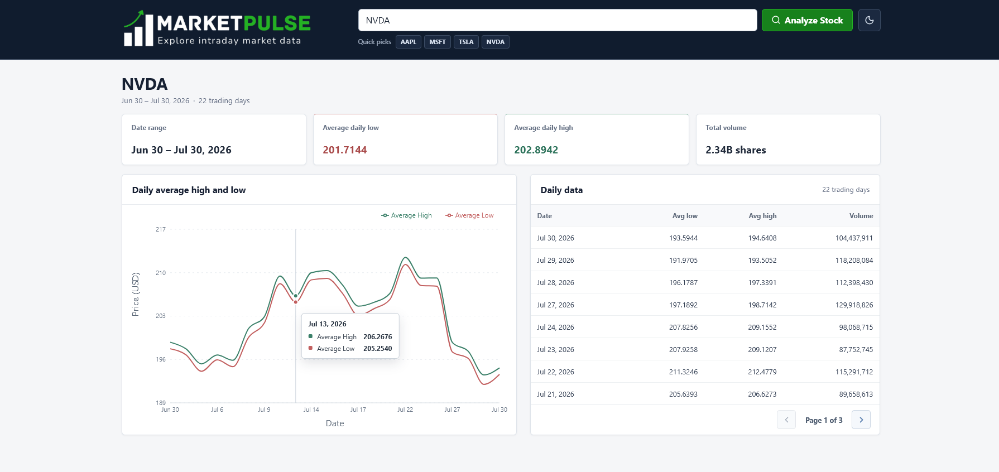
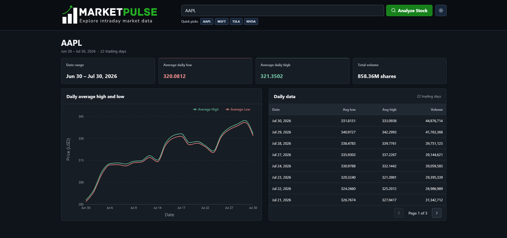

# MarketPulse

MarketPulse is a full-stack stock-data dashboard built as a maintainable,
production-minded MVP. A user enters a ticker symbol, the ASP.NET Core backend
retrieves one month of 15-minute market data from Yahoo Finance, and the React
frontend presents exchange-local daily averages and volume in a chart and
paginated table.

## Overview

The project keeps the request path deliberately small:

```text
React dashboard
  -> ASP.NET Core Minimal API
  -> stock-market application service
  -> Yahoo Finance HTTP client
  -> mapping and daily aggregation
  -> JSON response
```

Dependency injection separates the endpoint, application service, and provider
client. There is no database, EF Core, authentication, CQRS, or cloud-specific
infrastructure because none is needed for the current assessment.

## Original assessment requirements

| Requirement | Current implementation |
| --- | --- |
| Consume a public stock-market API | Yahoo Finance chart API |
| Use a self-hosted .NET 8+ or Node backend | ASP.NET Core .NET 8 Minimal API |
| Accept a stock symbol | Validated search form and quick picks |
| Retrieve roughly one month of intraday data | Yahoo `range=1mo`, `interval=15m` |
| Group records by day | Grouped by exchange-local trading date |
| Return day, average low, average high, and volume | Implemented by the API contract below |
| Present results in a supported frontend | React, TypeScript, and Vite |
| Display data meaningfully | Summary metrics, Recharts line chart, and table |
| Handle invalid symbols and request failures | Local validation, Problem Details, and friendly UI states |
| Include local setup instructions | Included in this README |
| Include an AI collaboration prompt log | Documented in [`PROMPT_LOG.md`](PROMPT_LOG.md) |

## Features

- Stock-symbol search with trimming, uppercase normalization, and validation
- Quick picks for AAPL, MSFT, TSLA, and NVDA
- Cancellation of obsolete frontend requests with `AbortController`
- Exchange-local grouping of intraday records into trading days
- Four-decimal average low and high values
- Null-aware price handling: missing averages are displayed as missing, never zero
- Daily volume calculated from non-null intraday volume values
- Date range, average low, average high, total volume, and trading-day count
- Responsive high/low line chart with accessible supporting text
- Descending daily-data table with eight rows per page
- Loading, empty, not-found, provider-error, timeout, and generic error states
- Responsive desktop, tablet, and mobile layouts
- Light and dark themes with system-preference detection and local persistence
- No unsupported company names, live prices, percentage changes, or profit/loss metrics

## Screenshots

### Light theme



### Dark theme



## Architecture

The backend follows a small layered design:

- **Endpoint:** validates the route symbol and returns HTTP results.
- **Application service:** converts timestamps to the exchange timezone, groups
  records by date, and calculates daily values.
- **Provider client:** owns Yahoo Finance request construction, response mapping,
  and provider-specific error classification.
- **Models:** define the provider mapping, internal intraday points, and public
  response contract.

The frontend keeps HTTP behavior in `stockApi.ts`, transformation and formatting
in utilities, and presentation in focused React components. Application state is
managed with React hooks; no global state library or router is required.

## Technology stack

| Area | Technology |
| --- | --- |
| Backend | ASP.NET Core Minimal APIs, .NET 8 |
| HTTP documentation | OpenAPI and Swagger |
| Market data | Yahoo Finance chart API |
| Frontend | React 19, TypeScript, Vite 8 |
| Visualization | Recharts |
| Icons | Lucide React |
| Backend tests | xUnit, `WebApplicationFactory`, coverlet |
| Frontend tests | Vitest, React Testing Library, jsdom |

## Repository structure

```text
MarketPulse.Api/
|-- MarketPulse.Api.slnx
|-- MarketPulse.Api/
|   |-- Clients/          # Yahoo provider abstraction and implementation
|   |-- Configuration/    # Yahoo client options
|   |-- Endpoints/        # Minimal API route definitions
|   |-- Exceptions/       # Domain-specific HTTP error mapping inputs
|   |-- Models/           # API, internal, and Yahoo response models
|   |-- Services/         # Daily aggregation application service
|   |-- Validation/       # Stock-symbol normalization and validation
|   `-- Program.cs        # Dependency injection and HTTP pipeline
|-- MarketPulse.Api.Tests/
|   |-- Clients/
|   |-- Endpoints/
|   |-- Services/
|   `-- Validation/
|-- frontend/
|   |-- src/
|   |   |-- components/
|   |   |-- constants/
|   |   |-- hooks/
|   |   |-- services/
|   |   |-- types/
|   |   `-- utils/
|   |-- package.json
|   `-- vite.config.ts
`-- docs/images/          # README banner and screenshots
```

## Backend request flow

1. `GET /api/stocks/{symbol}/intraday` reaches the Minimal API endpoint.
2. `StockSymbolValidator` trims the symbol, converts it to uppercase, and allows
   1-10 letters, numbers, periods, or hyphens.
3. `IStockMarketService` calls the injected `IStockMarketClient`.
4. `YahooFinanceClient` requests one month of 15-minute data with extended-hours
   records disabled.
5. Yahoo Unix timestamps and nullable low, high, and volume arrays are mapped
   into intraday points. If provider arrays have different lengths, only the
   shared valid index range is mapped.
6. Timestamps are converted to the exchange timezone and grouped by local date.
   If timezone resolution fails, the service logs a warning and falls back to
   UTC.
7. Non-null lows and highs are averaged independently and rounded to four
   decimal places using midpoint rounding away from zero. Non-null volumes are
   summed.
8. Results are ordered by ascending date and returned as JSON.
9. The React client derives summary values and presents the chart and table.

## API endpoint

```http
GET /api/stocks/{symbol}/intraday
Accept: application/json
```

Local example:

```text
http://localhost:5065/api/stocks/AAPL/intraday
```

Development-only Swagger UI:

```text
http://localhost:5065/swagger
```

A health endpoint is also available at `GET /health`.

## Successful response example

```json
[
  {
    "day": "2026-07-30",
    "lowAverage": 331.8151,
    "highAverage": 333.0938,
    "volume": 44876714
  }
]
```

`lowAverage` and `highAverage` may be `null` when a trading day contains no
valid values for that field. `volume` is a whole number.

## Error handling

The API uses Problem Details responses for errors:

| Status | Meaning |
| --- | --- |
| `400 Bad Request` | The symbol is empty, too long, or contains unsupported characters |
| `404 Not Found` | Yahoo reports an unknown/delisted symbol or returns no usable market data |
| `502 Bad Gateway` | Yahoo cannot be reached, returns a provider error, or sends an invalid response |
| `504 Gateway Timeout` | The configured Yahoo request timeout expires |
| `500 Internal Server Error` | An unexpected server error occurs |

Provider details and stack traces are not exposed to the frontend. The React
application converts these statuses into concise user-facing messages.

## Prerequisites

- [.NET 8 SDK](https://dotnet.microsoft.com/download/dotnet/8.0)
- Node.js `20.19.0+` or `22.12.0+` (required by the installed Vite version)
- npm
- Internet access for Yahoo Finance requests and initial package restore

## Backend setup

From the repository root:

```powershell
dotnet restore MarketPulse.Api.slnx
dotnet run --project MarketPulse.Api/MarketPulse.Api.csproj --launch-profile http
```

The HTTP launch profile serves the backend at `http://localhost:5065`.

Optional Yahoo settings are defined in `MarketPulse.Api/appsettings.json`:

```json
{
  "YahooFinance": {
    "BaseUrl": "https://query1.finance.yahoo.com",
    "TimeoutSeconds": 15
  }
}
```

## Frontend setup

In a second terminal:

```powershell
cd frontend
Copy-Item .env.example .env
npm ci
npm run dev
```

The Vite development server runs at `http://localhost:5173`.

For Bash-compatible shells, use `cp .env.example .env` instead of
`Copy-Item`.

## Environment variables

| Variable | Example | Purpose |
| --- | --- | --- |
| `VITE_API_BASE_URL` | `http://localhost:5065` | Backend base URL used by the React client |
| `YahooFinance__BaseUrl` | `https://query1.finance.yahoo.com` | Optional backend override for the provider URL |
| `YahooFinance__TimeoutSeconds` | `15` | Optional backend HTTP timeout override |
| `ASPNETCORE_ENVIRONMENT` | `Development` | Enables development behavior such as Swagger |

The backend development CORS policy allows `http://localhost:5173`.

## Running the application locally

1. Start the backend from the repository root:

   ```powershell
   dotnet run --project MarketPulse.Api/MarketPulse.Api.csproj --launch-profile http
   ```

2. Start the frontend from `frontend/`:

   ```powershell
   npm run dev
   ```

3. Open `http://localhost:5173` and search for a supported ticker.

Both processes must remain running while using the application.

## Running backend tests

From the repository root:

```powershell
dotnet test MarketPulse.Api.slnx
```

Backend unit and endpoint integration tests replace provider dependencies with
controlled implementations. They do not call Yahoo Finance.

## Running frontend tests

From `frontend/`:

```powershell
npm test -- --run
```

To verify a production frontend bundle:

```powershell
npm run build
```

Frontend tests mock the API layer and do not call the backend or Yahoo Finance.

## Design decisions

- **Minimal API over controllers:** the HTTP surface is small and benefits from
  a concise endpoint definition.
- **Provider interface:** Yahoo-specific behavior is isolated behind
  `IStockMarketClient`, which keeps the application service testable and allows
  another provider to be introduced later.
- **No database:** the MVP transforms provider data on demand and has no
  persistence requirement.
- **Exchange-local dates:** grouping uses Yahoo's exchange timezone instead of
  the server's local timezone.
- **Nullable averages:** missing provider values remain missing rather than
  being represented as zero.
- **Cancellation:** request cancellation flows through the frontend, endpoint,
  application service, and HTTP client.
- **Focused frontend state:** hooks are sufficient for the current single-page
  workflow; Redux and routing would add complexity without a present need.
- **Supported data only:** the interface does not infer company names, live
  prices, percentage changes, market status, or other unavailable metrics.

## Assumptions

- Yahoo Finance remains reachable and continues to provide the chart response
  fields used by the client.
- `range=1mo` is an acceptable interpretation of approximately the previous
  month.
- Regular-session 15-minute bars are sufficient for the assessment;
  pre-market and after-hours records are excluded.
- Daily volume is the sum of non-null volume values in the returned intraday
  bars.
- Yahoo's exchange timezone identifier can normally be resolved by the host
  operating system.

## Known limitations

- Yahoo Finance is an external public provider with no application-owned
  availability guarantee.
- There is no caching, retry policy, rate limiting, or persistent storage.
- The returned trading-day count depends on market holidays and provider data
  availability.
- A timezone lookup failure falls back to UTC, which can shift day boundaries
  for affected records.
- The application does not include company metadata, live quotes, portfolio
  tracking, authentication, or user accounts.
- The frontend and backend are configured for separate local development
  processes; production hosting configuration is not included.

## Future improvements

- Add caching and provider-aware rate limiting.
- Add bounded retry and circuit-breaker policies for transient upstream errors.
- Add structured telemetry and health checks for the Yahoo dependency.
- Add end-to-end browser tests covering the running frontend and backend.
- Add CI workflows for backend tests, frontend tests, and production builds.
- Add production deployment configuration and environment-specific CORS.

## AI-assisted development

AI tools were used as development collaborators for repository analysis, test
generation, frontend implementation support, UI refinement, and documentation
assistance. Generated work was reviewed against the existing architecture,
modified where needed, tested, and deliberately accepted or rejected rather
than applied without review.

See [`PROMPT_LOG.md`](PROMPT_LOG.md) for the detailed collaboration record,
including the prompts used, retained work, modifications, rejected suggestions,
manual decisions, and verification evidence.

## Note
Development was completed within approximately four hours, excluding final documentation and submission checks
